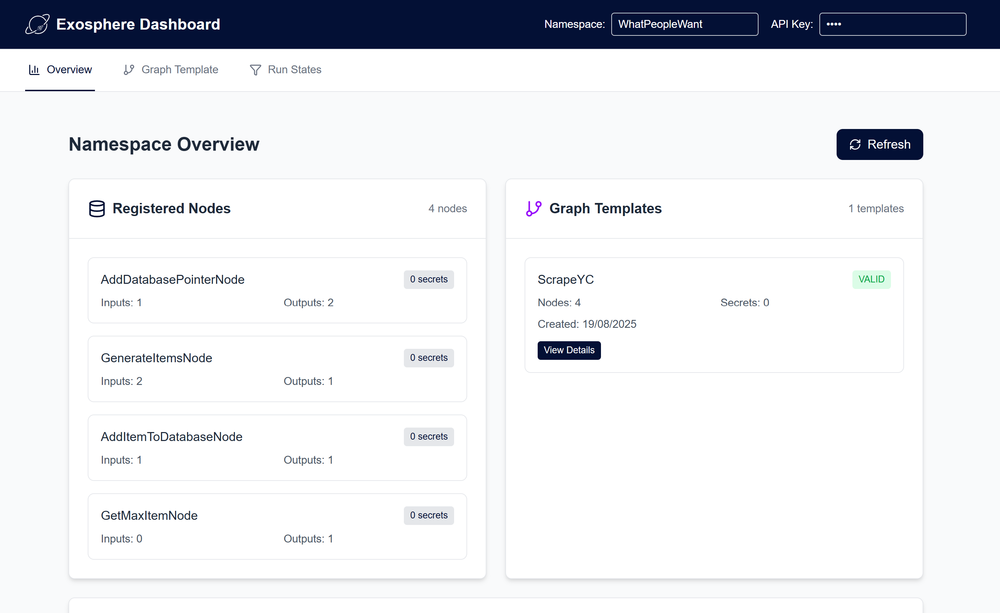
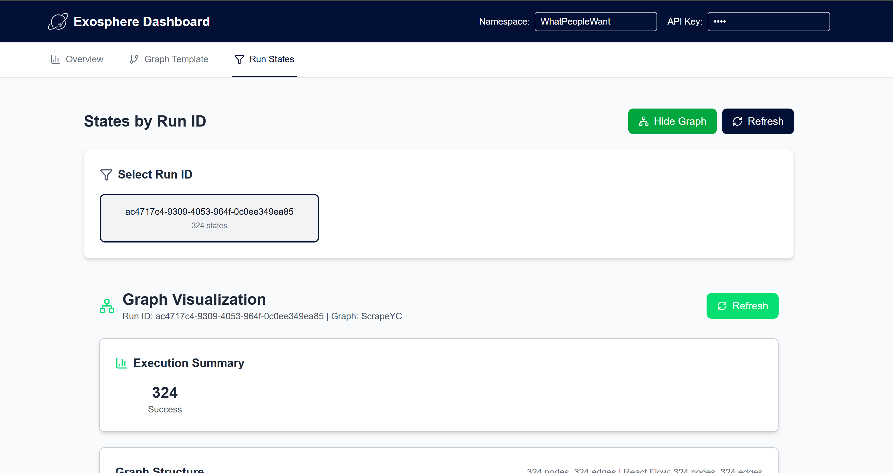
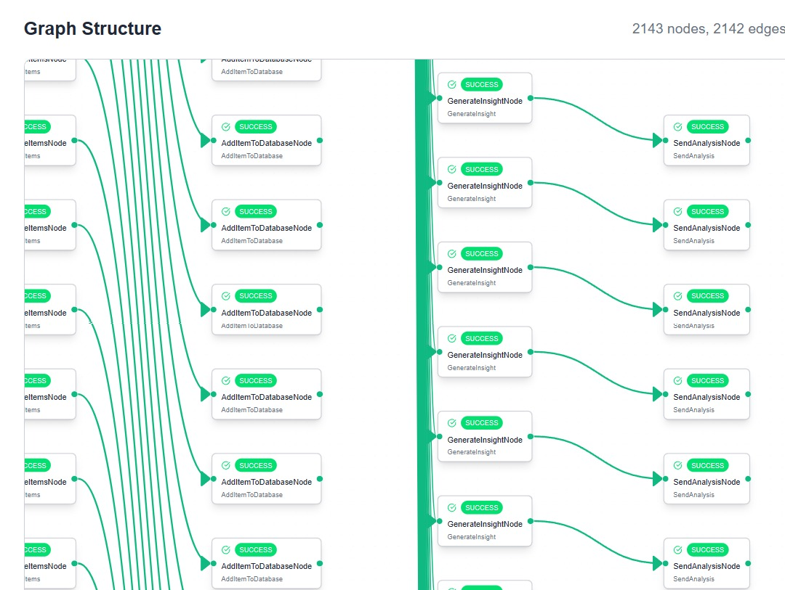

# Exosphere Dashboard

The Exosphere dashboard provides a comprehensive web interface for monitoring, debugging, and managing your workflows. This guide shows you how to set up and use the dashboard effectively.

## Dashboard Overview

The Exosphere dashboard is a modern web application that connects to your state manager backend through secure server-side routes and provides:

- **Real-time monitoring** of workflow execution
- **Visual graph representation** of your workflows
- **State management** and debugging tools
- **Performance metrics** and analytics
- **Error tracking** and resolution
- **Graph template management** and validation

## Setup Guide

### Prerequisites

Before setting up the dashboard, ensure you have:
- A running Exosphere state manager (see [State Manager Setup](./state-manager-setup.md))
- Your API key and namespace from the state manager
- Docker (for containerized deployment)
- Environment configuration file (`.env.local` for local development)

=== "Docker (Recommended)"

    The easiest way to run the dashboard is using the pre-built Docker container. This approach ensures consistent environments and minimal setup.

    #### Prerequisites

    - Docker installed

    #### Setup Steps

    1. **Pull the latest dashboard image and run**:
       ```bash
       # Pull the latest dashboard image
       docker pull ghcr.io/exospherehost/exosphere-dashboard:latest

       # Run the dashboard container with secure environment variables
       docker run -d \
         --name exosphere-dashboard \
         -p 3000:3000 \
         -e EXOSPHERE_STATE_MANAGER_URI="http://localhost:8000" \
         -e EXOSPHERE_API_KEY="your-secure-api-key" \
         -e NEXT_PUBLIC_DEFAULT_NAMESPACE="your-namespace" \
         ghcr.io/exospherehost/exosphere-dashboard:latest
       ```

    2. **Verify the service is running**:
       ```bash
       # Check container status
       docker ps
       
       # Check logs
       docker logs exosphere-dashboard
       
       # Test the dashboard
       curl http://localhost:3000
       ```

    The dashboard will be available at `http://localhost:3000`

    #### Required Environment Variables

    | Variable | Description | Required | Default |
    |----------|-------------|----------|---------|
    | `EXOSPHERE_STATE_MANAGER_URI` | State manager API endpoint | Yes | - |
    | `EXOSPHERE_API_KEY` | **REQUIRED**: Secure API key for state manager access | Yes | `exosphere@123` |
    | `NEXT_PUBLIC_DEFAULT_NAMESPACE` | Default namespace for workflows | No | `default` |
    
    > **💡 Default API Key**: `EXOSPHERE_API_KEY` defaults to `exosphere@123` (same as state manager's default secret)
    > 
    > **🔐 Authentication**: When the dashboard sends API requests to the state-manager, the `EXOSPHERE_API_KEY` value is checked for equality with the `STATE_MANAGER_SECRET` value in the state-manager container.
    
=== "Local Development"

    For development or customization, you can run the dashboard locally using the source code.

    #### Prerequisites

    - Node.js 18 or higher
    - npm or yarn package manager
    - Git

    #### Setup Steps

    1. **Clone the repository**:
       ```bash
       git clone https://github.com/exospherehost/exospherehost.git
       cd exospherehost/dashboard
       ```

    2. **Install dependencies**:
       ```bash
       npm install
       ```

    3. **Set up environment variables**:
       ```bash
       cp .env.example .env
       # Edit .env with your configuration
       ```

    4. **Start the development server**:
       ```bash
       npm run dev
       ```

    The dashboard will be available at `http://localhost:3000`

    #### Environment Variables

    Create a `.env.local` file in the dashboard directory with these variables:

    ```bash
    # Server-side secure configuration (NOT exposed to browser)
    EXOSPHERE_STATE_MANAGER_URI=http://localhost:8000
    EXOSPHERE_API_KEY=exosphere@123
    
    # Client-side configuration (exposed to browser)
    NEXT_PUBLIC_DEFAULT_NAMESPACE=your-namespace
    ```
    
    > **💡 Default API Key**: `EXOSPHERE_API_KEY` defaults to `exosphere@123` (same as state manager's default secret)
    > 
    > **🔐 Authentication**: When the dashboard sends API requests to the state-manager, the `EXOSPHERE_API_KEY` value is checked for equality with the `STATE_MANAGER_SECRET` value in the state-manager container.

## 🔒 Security Architecture

### **Server-Side Rendering (SSR) Implementation**

The Exosphere Dashboard has been refactored to use Next.js API routes for enhanced security:

- **API Key Protection**: All sensitive credentials are stored server-side
- **Secure Communication**: Client never directly communicates with state-manager
- **Environment Isolation**: Sensitive config separated from public code
- **Production Ready**: Enterprise-grade security for production deployments

### **API Route Structure**

```
/api/runs              → Secure runs fetching with pagination
/api/graph-structure   → Protected graph visualization data
/api/namespace-overview → Secure namespace summary
/api/graph-template    → Protected template management
```

### **Security Benefits**

1. **No API Key Exposure**: Credentials never visible in browser
2. **Server-Side Validation**: All requests validated before reaching state-manager
3. **Environment Security**: Sensitive variables isolated from client bundle
4. **Audit Trail**: All API calls logged server-side for monitoring

## Dashboard Interface

The Exosphere dashboard features a clean, modern interface with three main sections accessible via the navigation tabs at the top.



View registered nodes, and graph templates on a namespace




View graph runs and debug each node that was created.

## Using the Dashboard

1. **Configure Connection**:
   
      - Set your namespace in the header (or use environment variable)
      - API key is automatically handled server-side
      - Ensure your state manager is running

2. **Explore Overview**:

      - Review registered nodes and their capabilities
      - Check graph template status and validation
      - Monitor namespace statistics

3. **Manage Templates**:

      - View existing graph templates
      - Create new templates using the builder
      - Validate template configurations

4. **Monitor Execution**:

      - Select specific run IDs to track
      - View real-time execution progress
      - Debug failed states and errors

### Support

For additional help:
- Check the [State Manager Setup](./state-manager-setup.md) guide
- Review [Architecture](./architecture.md) for workflow understanding

## Next Steps

- **[Architecture](./architecture.md)** - Learn about fanout, units, inputs, outputs, and secrets
- **[State Manager Setup](./state-manager-setup.md)** - Complete backend setup guide
