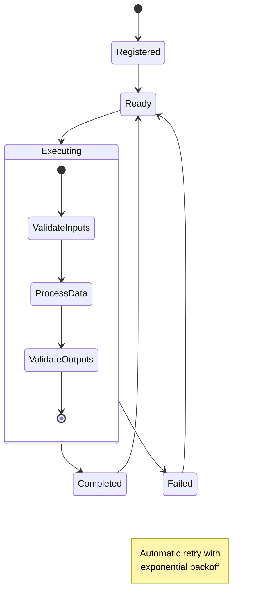

# Register Node

Nodes are the building blocks of Exosphere workflows. Each node defines a specific piece of processing logic with typed inputs, outputs, and secrets. This guide shows you how to create and register custom nodes.

> **📚 Getting Started**: For a complete local setup guide covering both the state manager and dashboard, see our [Local Setup Guide](./local-setup.md).

## Node Structure

Every node inherits from `BaseNode` and defines three key components:

```python
from exospherehost import BaseNode
from pydantic import BaseModel

class MyNode(BaseNode):
    class Inputs(BaseModel):
        # Define your input fields here
        pass

    class Outputs(BaseModel):
        # Define your output fields here
        pass

    class Secrets(BaseModel):
        # Define your secret fields here
        pass

    async def execute(self) -> Outputs:
        # Implement your processing logic here
        pass
```


### Node Lifecycle Architecture



### Inputs

Define the data your node expects to receive:

```python
class Inputs(BaseModel):
    user_id: str
    data: str
    config: str  # JSON string for complex configuration
    batch_size: str = "100"  # Default value
```

### Outputs

Define the data your node produces:

```python
class Outputs(BaseModel):
    processed_data: str
    metadata: str  # JSON string for complex metadata
    status: str
    count: str
```

### Secrets

Define sensitive configuration data your node needs:

```python
class Secrets(BaseModel):
    api_key: str
    database_url: str
    encryption_key: str
```

## Node Validation

The runtime automatically validates your nodes:

```python hl_lines="19"
from exospherehost import BaseNode
from pydantic import BaseModel

# ✅ Valid node
class ValidNode(BaseNode):
    class Inputs(BaseModel):
        data: str  # All fields must be strings

    class Outputs(BaseModel):
        result: str  # All fields must be strings

    class Secrets(BaseModel):
        api_key: str  # All fields must be strings

    async def execute(self) -> Outputs:
        return self.Outputs(result="success")

# ❌ Invalid node - non-string fields
class InvalidNode(BaseNode):
    class Inputs(BaseModel):
        data: str
        count: int  # Error: must be str

    class Outputs(BaseModel):
        result: str

    class Secrets(BaseModel):
        pass

    async def execute(self) -> Outputs:
        return self.Outputs(result="success")
```

## Node Registration

Nodes are automatically registered when you start your runtime:

```python hl_lines="14"
from exospherehost import Runtime, BaseNode

# Create your nodes
class Node1(BaseNode):
    # ... node implementation

class Node2(BaseNode):
    # ... node implementation

# Register nodes with runtime
Runtime(
    namespace="MyProject",
    name="MyRuntime",
    nodes=[Node1, Node2]  # Both nodes will be registered
).start()
```

## Node Naming and Organization

### Namespace Organization

Organise nodes to a namespace to reuse them across flows in that namespace

```python hl_lines="3 10"
# Development namespace
Runtime(
    namespace="dev",
    name="MyRuntime",
    nodes=[MyNode]
).start()

# Production namespace
Runtime(
    namespace="prod",
    name="MyRuntime",
    nodes=[MyNode]
).start()
```

## Next Steps

- **[Create Graph](./create-graph.md)** - Learn how to connect nodes into workflows
- **[Trigger Graph](./trigger-graph.md)** - Execute and monitor your workflows
